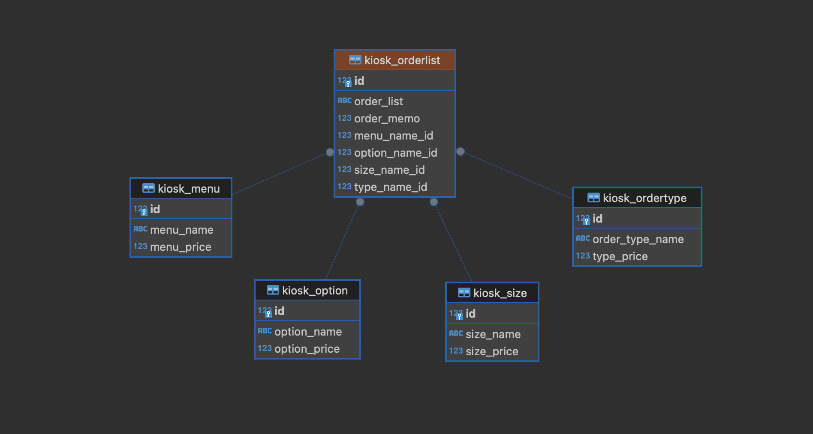

# proj_minicafe# 미니 카페 키오스크 프로그램

## DB

 

## 기능
1. kiosk
- 메뉴 선택
- 추가 옵션 선택 및 주문 메모 작성
- 주문 리스트 출력

 

##  Model
**1.메뉴**
|메뉴|Caffee Americano, Caffee Latte, Cappuccino, ...|
|---|---|
|가격|4500, 5000, 5000, ...|

**2.주문 타입**
|주문타입|
|---|
|store, packaging|

**3.옵션**
|옵션|hot, ice|
|---|---|
|옵션가격|0, 0|

|사이즈|tall, grande, venti|
|---|---|
|사이즈 가격|0, 500, 1000|

|주문타입|
|---|
|store, packaging|

주문메모
|주문메모|얼음적게 ....|
|---|---|
|날짜|...|

**4.주문서 출력**
메뉴 
옵션1 
옵션2(사이즈) 
옵션3(주문타입) 
옵션4(주문메모)